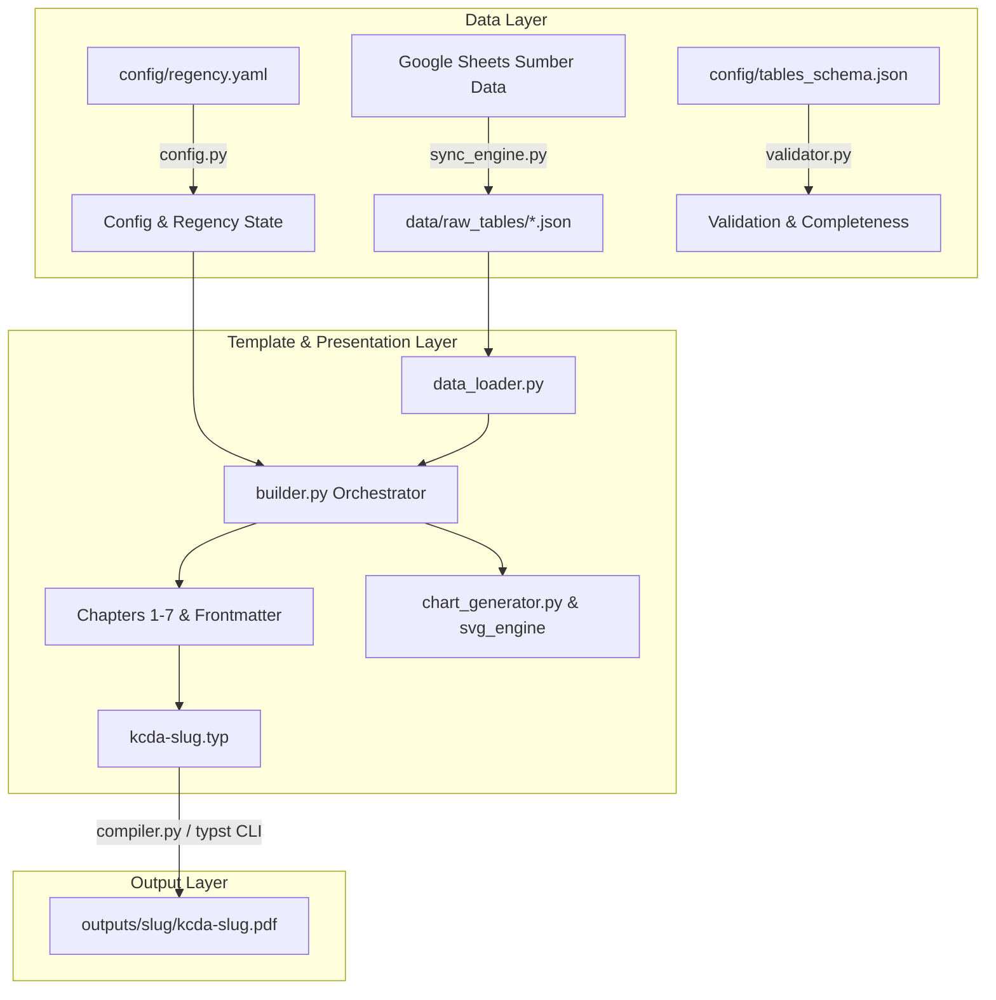

# Arsitektur Sistem KCDA Agent

Generator publikasi **Kecamatan Dalam Angka (KCDA)** dibangun dengan memisahkan domain data, tata letak dokumen (Typst layout engine), dan orkestrasi agentic.

---

## 1. Diagram Alur Sistem (System Flowchart)

---

## 2. Struktur Modul Python (`scripts/kcda_generator/`)

- `config.py`: Parser tunggal konfigurasi daerah (`config/regency.yaml`) dengan fallback ke `regency.example.yaml`.
- `validator.py`: **Placeholder Guard** dan auditor kelengkapan tabel wajib per kecamatan.
- `data_loader.py`: Abstraksi pembacaan sel, normalisasi baris, dan ekstraksi data per tab kecamatan.
- `sync_engine.py`: Engine penarik spreadsheet Google Sheets via REST API menjadi JSON lokal.
- `table_renderer.py`: Format tabel ukuran A5 standar BPS dengan format dwibahasa otomatis (*bilingual auto-styling*).
- `chart_generator.py` & `charts/`: Generator grafik vektor murni (SVG) tanpa dependensi matplotlib yang berat.
- `builder.py`: Komposer naskah Typst ukuran A5 lengkap dari cover depan sampai backcover.
- `compiler.py`: Pemanggil compiler Typst resmi (`typst compile`) dengan deteksi font dan isolasi root.

---

## 3. Kompatibilitas BPS & Pedoman Desain

Naskah yang dihasilkan sepenuhnya patuh pada:
- **Pedoman Pembuatan Publikasi BPS 2023** (Ukuran A5, penomoran recto/verso, layout tabel dwibahasa).
- **Template Resmi KCDA BPS 2026** (Cover, halaman katalog, kata pengantar text-wrap meander, infografis pembuka bab, daftar pustaka).
- **Format Typst 0.13.0+** dengan waktu kompilasi sub-detik (~1 detik per publikasi 40+ halaman).
